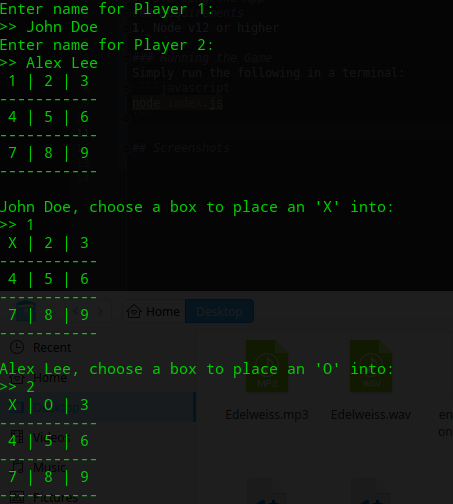
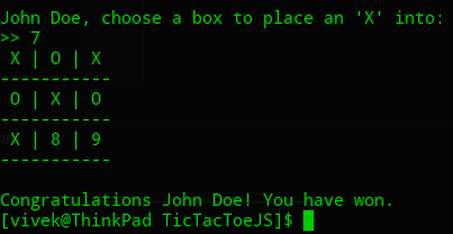

# TicTacToeJS

## Instructions
1. Install a stable version of NodeJS (tested: Node 12.13.0)
2. Clone locally using
   `git clone https://github.com/vivekscl/TicTacToeJS.git` (use `git checkout NxNTicTacToe` to try the NxN version)
3. Install `Jest` using `npm install` (If you want to run tests)
4. Run tests using `npm test`
5. Start the app using `npm start`
6. Enjoy!

## Discussion
1. I used JavaScript to implement the app.
2. Used Object Oriented Programming Paradigm to implement the app for the following reasons:
    * To achieve clear separation of concerns.
    * Encapsulate data and functionality.
    * Ensure Single Responsibility Principle is maintained easily.

## Requirements
#### Build a two player tic tac toe app where a game is played by alternating input until the game is won by Player 1 (X), Player 2 (O) or is a tie.
1. Ask the names of players 1 and 2.
    * Input and output is handled using Node's `readline` module, `console.log`, `process.stdin` and `process.stdout` 
2. Alternate between input for player 1 and player 2.
    * Ensure input is validated before updating the board. Otherwise, ask player to provide input again.
3. Stop when one of the player has won or when all the moves have been exhausted.
    * This happens if a player places 3 markers in a row (horizontally, vertically or diagonally) or if the board is full.

## Screenshots

